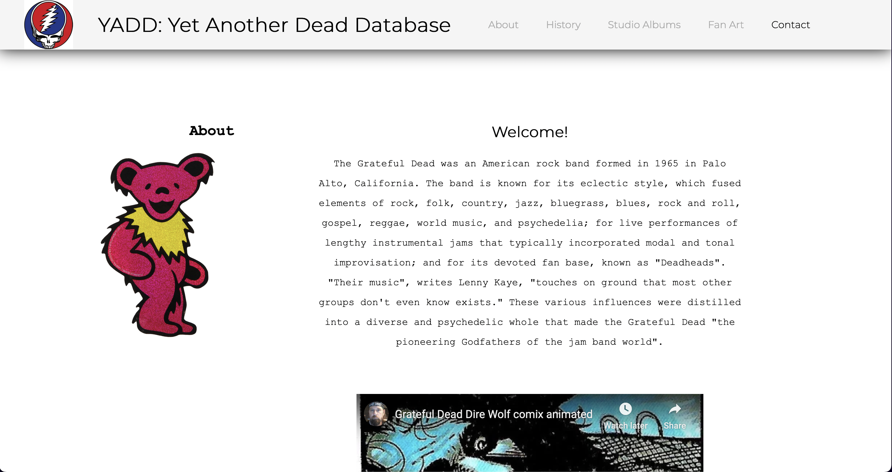

 

# YADD: Yet Another (Grateful) Dead Database
YADD is a project made by [Nick Kammerer](mailto:nkammerer@albany.edu) which seeks to make  Grateful Dead information
more accessible for the Deadhead community.

### Features

- Relational database containing song and album information for the Grateful Dead's studio albums.
- Web application capable of searching the database and returning query results.
- Information pages about The Grateful Dead including a general overview, an extended history of the band. studio 
albums, and fan art. 
